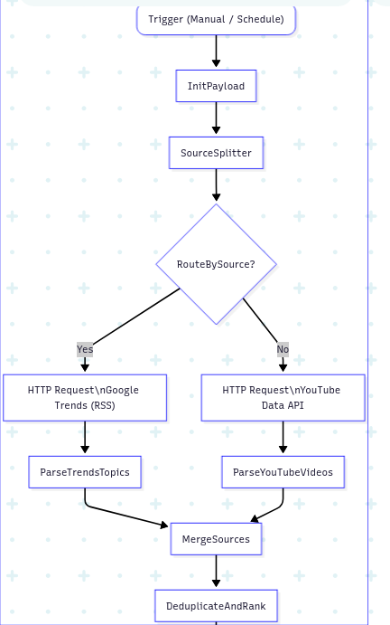
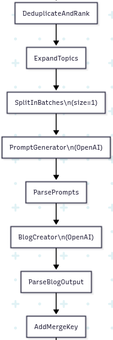
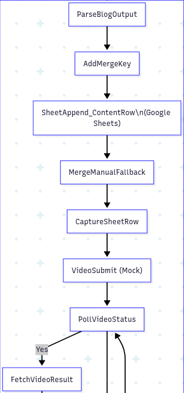
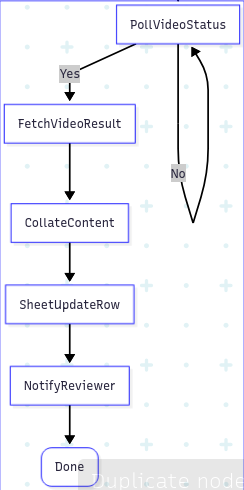
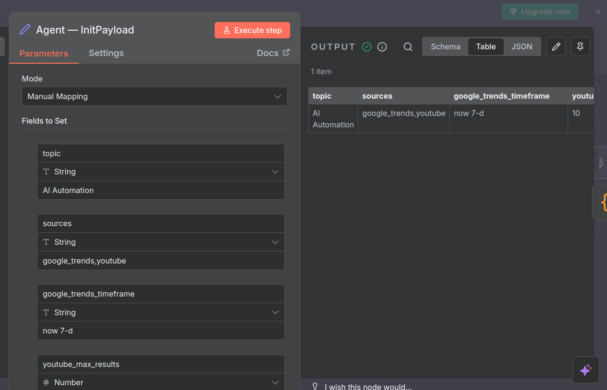
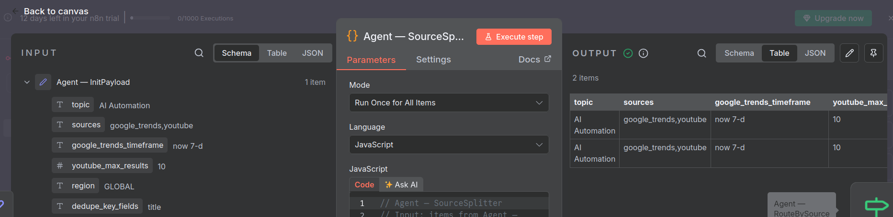
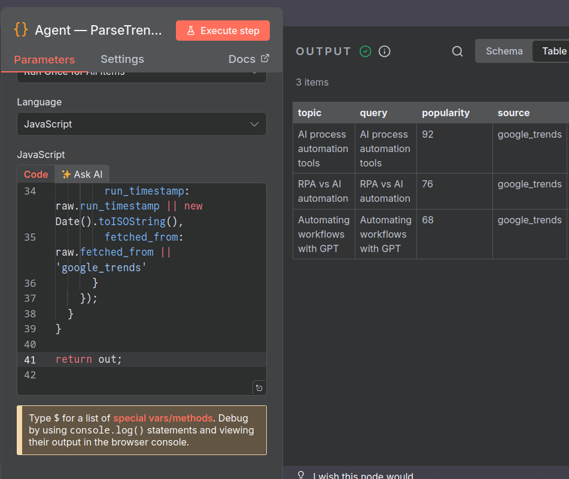
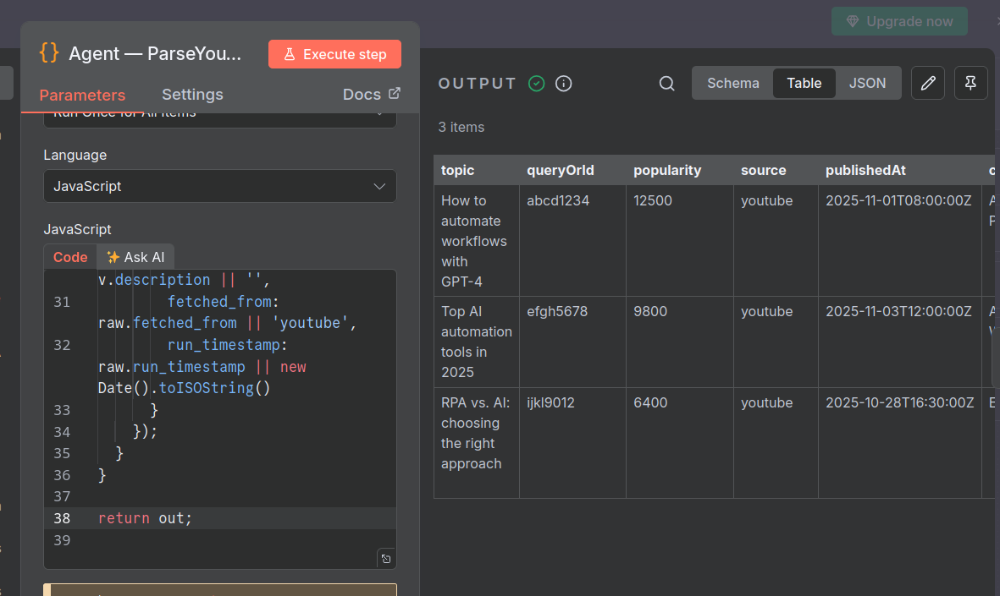
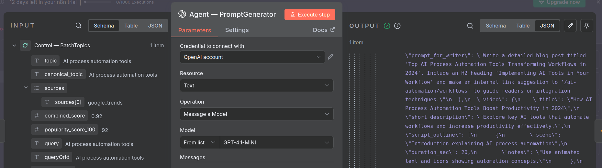
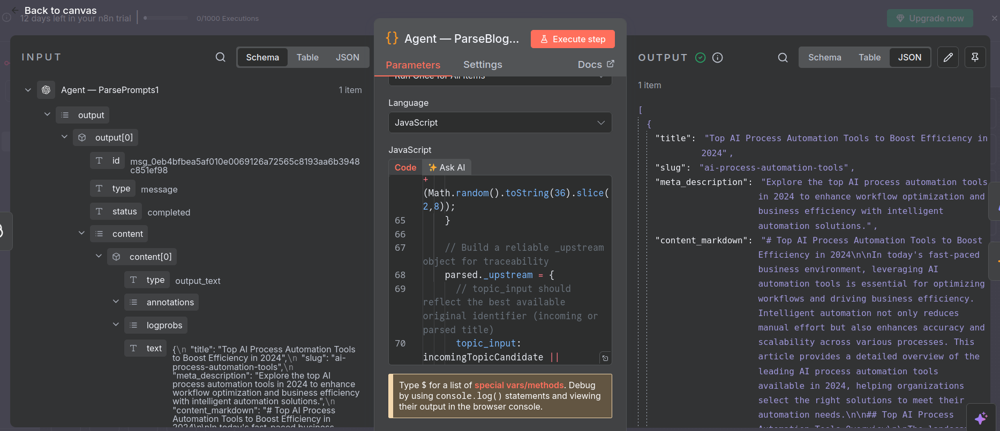

# 🤖 Multi-Agent AI Content Pipeline — Built in n8n

> An end-to-end AI-driven automation workflow for researching trending topics, generating creative prompts, creating blog + video content, and submitting it for human review — fully orchestrated inside **n8n**.

---

## 🧠 Overview

This project demonstrates a **modular multi-agent system** built using **n8n**, where each agent is responsible for a stage of the AI content production lifecycle:

1. **ContentResearch Agent** — Gathers trending AI topics from Google Trends & YouTube.
2. **Prompt Agent** — Uses OpenAI to generate creative blog/video prompts.
3. **ContentCreator Agent** — Creates blog posts & video content (mocked for demo).
4. **ContentSubmission Agent** — Submits all generated content to Google Sheets for human review.

Each agent acts as an autonomous component passing structured data downstream — simulating a scalable AI orchestration architecture.

**Link for workflow json:** https://drive.google.com/drive/folders/1CUm13o-X8XpJiveO6-X1G2I_CDuXOknj?usp=sharing

**Spreadsheet link:** https://docs.google.com/spreadsheets/d/1p_dsc8N7aWOCTcm4kg6UECUX3yWpmPP0cT-3xRPLgJQ/edit?gid=0#gid=0

---

## ⚙️ Tech Stack

| Component                      | Tool / API                          | Purpose                                |
| ------------------------------ | ----------------------------------- | -------------------------------------- |
| **Automation Framework**       | n8n                                 | Workflow orchestration                 |
| **LLM / Prompt Generation**    | OpenAI API (GPT-4)                  | Generates structured prompts & content |
| **Data Sources**               | Google Trends RSS, YouTube Data API | Fetch trending topics                  |
| **Storage / Review**           | Google Sheets API                   | Store and manage outputs               |
| **Notification (Optional)**    | Slack / Gmail                       | Notify reviewers on new content        |
| **Future Integration (Video)** | Runway / Gemini API                 | AI video generation                    |

---

## 🧩 Workflow Architecture
<table>
  <tr>
    <td></td>
    <td></td>
    <td></td>
    <td></td>
  </tr>
</table>


---

## 🧮 Data Flow Summary

| Stage                 | Description                                    | Example Output                                |
| --------------------- | ---------------------------------------------- | --------------------------------------------- |
| **Research**          | Collects trending AI topics                    | `AI Process Automation`, `RPA vs AI`          |
| **Prompt Generation** | Creates creative content prompts               | Blog + Video prompts JSON                     |
| **Content Creation**  | Generates long-form blogs & mock video prompts | Markdown + Script outlines                    |
| **Submission**        | Appends results to Google Sheets               | Topic, Prompt, Blog, Video, Timestamp, Status |

---

## 📸 Screenshots

<table>
  <tr>
    <td></td>
    <td></td>
    <td></td>
    <td></td>
    <td></td>
    <td></td>
    <td></td>
  </tr>
</table>


---

## 🧱 Folder Structure

```
.
├── Architecture.md       # Detailed flow, system design & n8n workflow link
├── README.md             # Project documentation (this file)
└── /screenshots          # Node and output screenshots
```

---

## 🚀 Key Highlights

✅ **Multi-agent structure** — Each stage modularized as an independent agent.
✅ **Full data lineage** — Topic → Prompt → Blog → Sheet tracked across nodes.
✅ **Human-in-the-loop** — Pending review stage in Google Sheets.
✅ **Plug-and-play architecture** — Swap APIs (e.g., Gemini, Runway) without refactoring.
✅ **Future-ready** — Can scale to video, Notion, or Slack integrations.

---

## 📘 How to Run

1. Import the `.json` workflow into your **n8n Cloud** or local instance.
2. Set up credentials for:

   * OpenAI API
   * Google Sheets
   * YouTube Data API
   * (Optional) Gemini / Runway API
3. Execute the workflow manually or schedule it via the **Cron Trigger**.

---

## 📊 Example Output (Google Sheet)

| Topic                       | Prompt              | Blog Content       | Video Link | Timestamp  | Status         |
| --------------------------- | ------------------- | ------------------ | ---------- | ---------- | -------------- |
| AI Process Automation Tools | “Generate blog on…” | Full blog markdown | Pending    | 2025-11-10 | Pending Review |

---

## Loom Link For Demo

https://www.loom.com/share/91f5a17df2c54bf78622eede302cdd43

## 🧩 Author

Arti Rani— AI Automation Engineer
📧 artirani.com@hotmail.com
💼 https://linkedin.com/raniarti

---

## 🏁 License

MIT License © 2025 Arti Rani
You are free to fork, modify, and build on this workflow.

